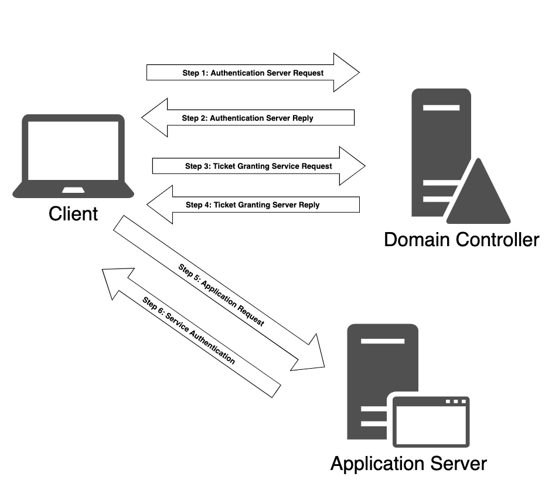

# Authentication

**KEY TAKEAWAY**

**NTLM is used when a client authenticates to a server by IP address (instead of by hostname), or if the user attempts to authenticate to a hostname that is not registered on the Active Directory-integrated DNS server.**

**Kerberos is prioritized when a client authenticates to the server by hostname**

## NTLM

NTLM authentication is used when a client authenticates to a server by IP address (instead of by hostname), or if the user attempts to authenticate to a hostname that is not registered on the Active Directory-integrated DNS server.

In NTLM, the client interacts directly with the application server, and the application server verifies the client with the domain controller.
## Kerberos

The KDC is the domain controller

The "Server" is the application server

[Source](https://software.intel.com/sites/manageability/AMT_Implementation_and_Reference_Guide/WordDocuments/introductiontokerberosauthentication.htm)

[Explination](https://www.youtube.com/watch?v=5N242XcKAsM)

At a high level

- We first get a Ticket Granting Ticket (TGT) from the Authentication Server (AS)
- Then when we go to access a domain resource, we send the Ticket Granting Server (TGS) our TGT to get a Service Ticket (ST) for the specified resource
- We then access the specified resource with the ST

## Cached AD Credentials

Since Microsoft's implementation of Kerberos makes use of single sign-on, password hashes must be stored somewhere in order to renew a TGT request.

In modern versions of Windows, these hashes are stored in the *Local Security Authority Subsystem Service* (LSASS) memory space. Since the LSASS process is part of the operating system and runs as SYSTEM, we need SYSTEM (or local administrator) permissions to gain access to the hashes stored on a target.
